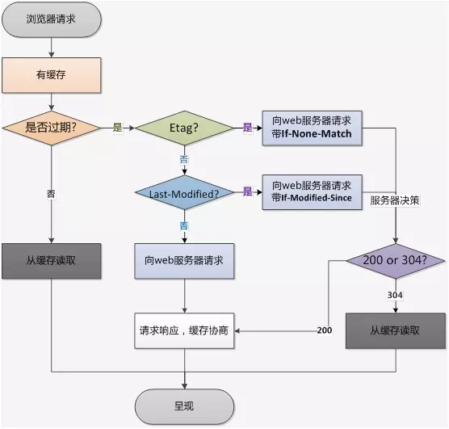

## 缓存
从两部分来介绍缓存：其中包括缓存校验/缓存控制
缓存控制：
Expires

Expires是http1.0提出的一个表示资源过期时间的header，它描述的是一个绝对时间，由服务器返回。Expires 受限于本地时间，如果修改了本地时间，可能会造成缓存失效

Cache-Control

- 作为请求字段：
  - no-cache：代表不要从缓存中返回过期的资源。 客户端发送的请求中如果包含 no-cache 指令，则表示客户端强制向源服务器再次确认。校验成功则返回304
  - no-store：代表请求的资源不会被缓存，下次任何其它请求获取该资源，还是会从服务器获取，返回 200，即资源本身。

- 作为响应头字段：
  - no-cache：如果服务器返回的响应中包含 no-cache 指令，每次客户端请求，必需先向服务器确认其有效性，如果资源没有更改，则返回304。
  - no-cache：不对响应的资源进行缓存，即用户下次请求还是返回 200，返回资源本身。
  - public：表示响应可以被任何缓存区缓存(客户端和代理服务器都可缓存)。如果响应被标记为public，即使有关联的 HTTP 认证，甚至响应状态码无法正常缓存，响应也可以被缓存。大多数情况下，public 不是必须的，因为明确的缓存信息（例如max-age）已表示 响应可以被缓存。
  - private：表示对于单个用户的响应，不能被共享缓存处理。私有的缓存区可以存储(仅客户端可以缓存，代理服务器不可缓存)。相比之下，浏览器可以缓存 private 响应，但是通常只为单个用户缓存，因此，不允许任何中继缓存对其进行缓存 - 例如，用户浏览器可以缓存包含用户私人信息的 HTML 网页，但是 CDN 不能缓存。

  

  - max-age：过期机制中，最重要的指令是 "max-age=<seconds>"，表示资源能够被缓存（保持新鲜）的最大时间。相对Expires而言，max-age是距离请求发起的时间的秒数。针对应用中那些不会改变的文件
  - must-revalidate：告诉浏览器、缓存服务器，本地副本过期前，可以使用本地副本；本地副本一旦过期，必须去源服务器进行有效性校验。

缓存校验：

  - ETag: 资源唯一标识符
  - If-None-Match: 与ETag相对应，对比ETag是否相匹配

  假定在首次提取资源 120 秒后，浏览器又对该资源发起了新的请求。 首先，浏览器会检查本地缓存并找到之前的响应。 遗憾的是，该响应现已过期，浏览器无法使用。 此时，浏览器可以直接发出新的请求并获取新的完整响应。 不过，这样做效率较低，因为如果资源未发生变化，那么下载与缓存中已有的完全相同的信息就毫无道理可言！

  这正是验证令牌（在 ETag 标头中指定）旨在解决的问题。 服务器生成并返回的随机令牌通常是文件内容的哈希值或某个其他指纹。 客户端不需要了解指纹是如何生成的，只需在下一次请求时将其发送至服务器。 如果指纹仍然相同，则表示资源未发生变化，您就可以跳过下载。

  客户端自动在“If-None-Match” HTTP 请求标头内提供 ETag 令牌。 服务器根据当前资源核对令牌。 如果它未发生变化，服务器将返回“304 Not Modified”响应，告知浏览器缓存中的响应未发生变化，可以再延用 120 秒。 请注意，您不必再次下载响应，这节约了时间和带宽。

  - Last-Modified: 资源最后修改的时间
  - If-Modified-Since: 比对Last-Modified相对应

缓存最佳实践

  1、HTML 被标记为“no-cache”，这意味着浏览器在每次请求时都始终会重新验证文档，并在内容变化时提取最新版本。 此外，在 HTML 标记内，您在 CSS 和 JavaScript 资产的网址中嵌入指纹：如果这些文件的内容发生变化，网页的 HTML 也会随之改变，并会下载 HTML 响应的新副本。

  2、允许浏览器和中间缓存（例如 CDN）缓存 CSS，并将 CSS 设置为 1 年后到期。 请注意，您可以放心地使用 1 年的“远期过期”，因为您在文件名中嵌入了文件的指纹：CSS 更新时网址也会随之变化。

  3、JavaScript 同样设置为 1 年后到期，但标记为 private，这或许是因为它包含的某些用户私人数据是 CDN 不应缓存的。

  4、图像缓存时不包含版本或唯一指纹，并设置为 1 天后到期。

浏览器缓存流程

## 参考
[深入理解HTTP缓存机制及原理](https://juejin.im/post/5c93ba526fb9a070ca103898)
[web性能优化之：no-cache与must-revalidate深入探究](https://segmentfault.com/a/1190000007317481)
[HTTP 缓存](https://developers.google.com/web/fundamentals/performance/optimizing-content-efficiency/http-caching?hl=zh-cn)
