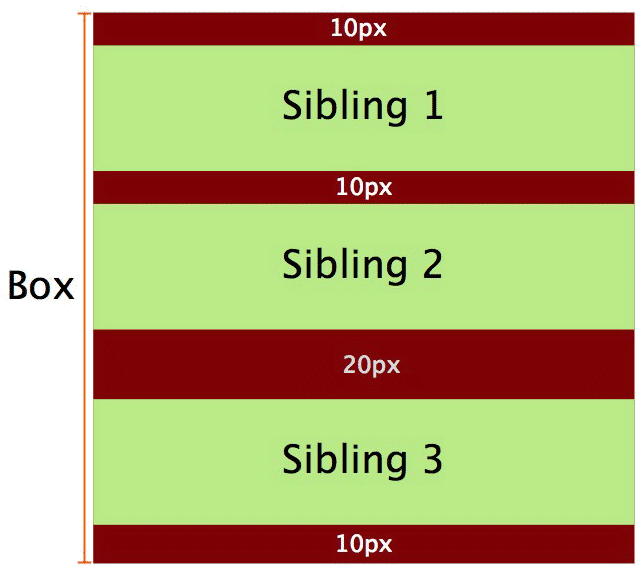
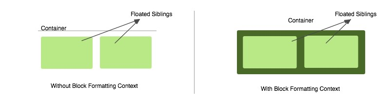
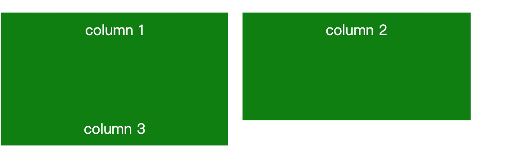
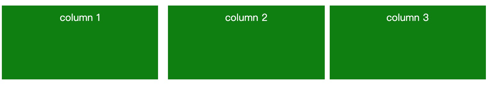

# BFC

块格式化上下文（Block Formatting Context，BFC） 是Web页面的可视CSS渲染的一部分，是块盒子的布局过程发生的区域，也是浮动元素与其他元素交互的区域。
## 什么是BFC？

块级格式上下文。那么块级格式上下文是什么呢？看下面W3C的解释:

Floats, absolutely positioned elements, block containers (such as inline-blocks, table-cells, and table-captions) that are not block boxes, and block boxes with 'overflow' other than 'visible' (except when that value has been propagated to the viewport) establish new block formatting contexts for their contents.

Floats、绝对定位元素、阻止不是块框的容器(如行内块、表格单元格和表格标题) ，以及阻止除“可见”以外的“溢出”框(除非该值已经传播到视图窗口) ，为其内容建立新的块格式上下文。

In a block formatting context, boxes are laid out one after the other, vertically, beginning at the top of a containing block. The vertical distance between two sibling boxes is determined by the 'margin' properties. Vertical margins between adjacent block-level boxes in a block formatting context collapse.

在块格式化上下文中，从包含块的顶部开始，垂直地一个接一个地布置框。 两个同属框之间的垂直距离由“ margin”属性决定。 块格式上下文中相邻块级框之间的垂直边距折叠。(注：这就是为什么两个div，其中一个设置margin-bottom,一个设置margin-top会发生折叠)

In a block formatting context, each box's left outer edge touches the left edge of the containing block (for right-to-left formatting, right edges touch). This is true even in the presence of floats (although a box's line boxes may shrink due to the floats), unless the box establishes a new block formatting context (in which case the box itself may become narrower due to the floats).

在块级格式化上下文中，每个框的左外边缘都接触包含块的左边缘（对于从右到左的格式，右边缘接触）。即使存在floats也是如此（尽管框的行框可能因floats而缩小），除非框建立了新的块格式化上下文（在这种情况下，框本身可能会由于floats而变窄）。（注：这就是为什么一个浮动元素和一个文字标签，浮动元素被文字包裹）

在我们了解完什么是块级格式化上下文之后：那么哪些属性可以创建块级格式化上下文

## 产生BFC

 - 根元素(<html>)
 - 浮动元素（元素的 float 不是 none）
 - 绝对定位元素（元素的 position 为 absolute 或 fixed）
 - 行内块元素（元素的 display 为 inline-block）
 - 表格单元格（元素的 display为 table-cell，HTML表格单元格默认为该值）
 - 表格标题（元素的 display 为 table-caption，HTML表格标题默认为该值）
 - 匿名表格单元格元素（元素的 display为 table、table-row、 table-row-group、table-header-group、table-footer-group（分别是HTML table、row、tbody、thead、tfoot的默认属性）或 inline-table）
 - overflow 值不为 visible 的块元素
 - display 值为 flow-root 的元素
 - contain 值为 layout、content或 paint 的元素
 - 弹性元素（display为 flex 或 inline-flex元素的直接子元素）
 - 网格元素（display为 grid 或 inline-grid 元素的直接子元素）
 - 多列容器（元素的 column-count 或 column-width 不为 auto，包括 column-count 为 1）
 - column-span 为 all 的元素始终会创建一个新的BFC，即使该元素没有包裹在一个多列容器中（标准变更，Chrome bug）。

## BFC可以帮助我们解决什么问题

情况一：在*同一个块级格式化上下文*（下面就简写成BFC）中还发生margin折叠
```html
<div class="container">
  <p>Sibling 1</p>
  <p>Sibling 2</p>
</div>
```
```css
.container {
  background-color: red;
  overflow: hidden; /* creates a block formatting context */
}

p {
  background-color: lightgreen;
  margin: 10px 0;
}
```


如图所示：两个P标签之间的margin并不等于20，那么怎么解决这个问题呢，注意，上面强调的是在同一个BFC中才会发生这种情况，所以只需要让他在产生一个新的BFC就好
```html
<div class="container">
  <p>Sibling 1</p>
  <p>Sibling 2</p>
  <div class="newBFC">
    <p>Sibling 3</p>
  </div>
</div>
```
```css
.container {
  background-color: red;
  overflow: hidden; /* creates a block formatting context */
}

p {
  margin: 10px 0;
  background-color: lightgreen;
}

.newBFC {
  overflow: hidden;  /* creates new block formatting context */
}
```


情况二：在一个容器中，没有设置高度，会发生浮动的子元素不能撑开父元素（如下图所示左边）:

```html
<div class="container">
  <div>Sibling</div>
  <div>Sibling</div>
</div>
```
```css
.container {
  background-color: green;
}

.container div {
  float: left;
  background-color: lightgreen;
  margin: 10px;
}
```
上面的情况我们也可以用clear去解决这个问题，同样也可以用BFC来解决这个问题
```css
.container {
  overflow: hidden; /* creates block formatting context */
  background-color: green;
}

.container div {
  float: left;
  background-color: lightgreen;
  margin: 10px;
}
```
如上图右半部分所示

情况三：BFC可以阻止text warp的情况，如下图左边所示：

```html
<div class="container">
  <div class="floated">
    Floated div
  </div>
  <p>
    Quae hic ut ab perferendis sit quod architecto, 
    dolor debitis quam rem provident aspernatur tempora
    expedita.
  </p>
</div>
```
上图中的整个黑色区域表示 p 元素。 正如我们所看到的，p 元素没有移动，而是移到了浮动元素下面。 P 元素的行框(指文本的行)进行移位。 因此，行框在水平方向上变窄，以便为被浮动元素留出空间。随着文本的增加，它最终将在浮动元素下换行，因为行框不再需要移动，因此会出现图1所示的条件。 这解释了即使存在浮动元素，段落如何触及包含框的左边缘，以及行框如何缩小以容纳浮动元素。根据BFC的第三段定义，如果 p 元素建立了一个新的块格式上下文，那么它将不再接触容器块的左边缘。 这可以通过简单地将 overflow: hidden 添加到 p 元素来实现。 通过这种方式，创建一个新的块格式上下文解决了在浮动对象周围环绕文本的问题。

情况四：BFC可以用于多行布局 如下图所示

```html
<div class="container">
  <div class="column">column 1</div>
  <div class="column">column 2</div>
  <div class="column">column 3</div>
</div>
```
```css
.column {
  width: 31.33%;
  background-color: green;
  float: left;
  margin: 0 1%;
}

.column:last-child {
  float: none;
  overflow: hidden;
}
```
这时候会发现最后一列有时会移到下一行。 这种情况可能发生，因为浏览器舍入了列的宽度，总宽度变得比容器的宽度更大。 但是，如果我们在布局的一列中建立一个新的块格式上下文，那么它将始终占用前面列填充之后剩余的空间。



## 参考
[W3C BFC解释](https://www.w3.org/TR/CSS2/visuren.html#block-formatting)