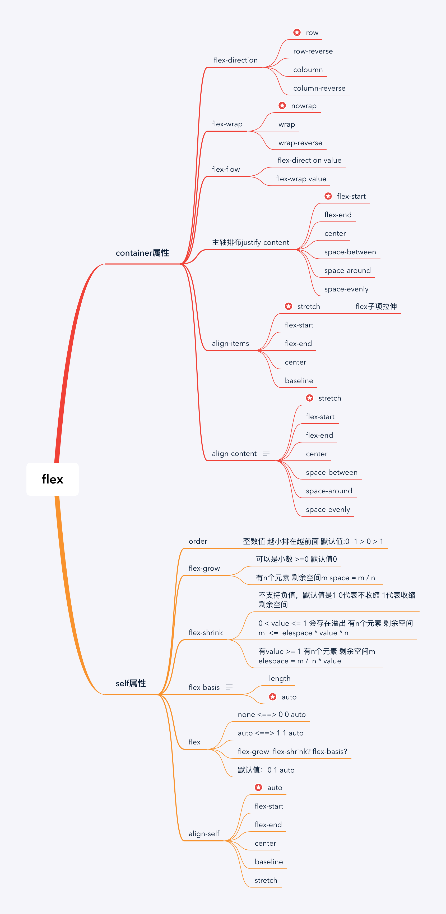

# 大话Flex布局

> Flexible Box 模型，通常被称为 flexbox，是一种一维的布局模型。它给 flexbox 的子元素之间提供了强大的空间分布和对齐能力。

## flex 容器

flex容器决定子元素排布方式（子元素align-self除外），之所以说flex是一维的布局模型，是因为它通过主轴和交叉轴来决定元素的位置。位置是由方向决定的，所以flex-direction: 决定了flex的主轴方向，那么交叉轴必然跟主轴垂直。这时候就形成了一个直角坐标系，这个坐标系有了x(主轴的方向)和y(交叉轴的方向)，方向确定之后，就需要确定这个元素落在哪， justify-content和align-items就帮助元素的确定起止点和终点。那么当子元素的总宽度大于flex容器的宽度时，业务场景是不想让子元素溢出，flex可以控制子元素是否换行：flex-warp

## flex 子元素

flex元素是没必要设置宽度的（除两列布局自适应布局那种情况）或者说是怎么分配flex容器的空间，flex子元素们设置flex属性进行空间分配，但无论做什么事都有例外，那么子元素里面那个例外怎么处理呢，align-self + order闪亮登场，它控制单独某一个flex子项的垂直对齐方式, order的值让他可以去主轴的任何位置

